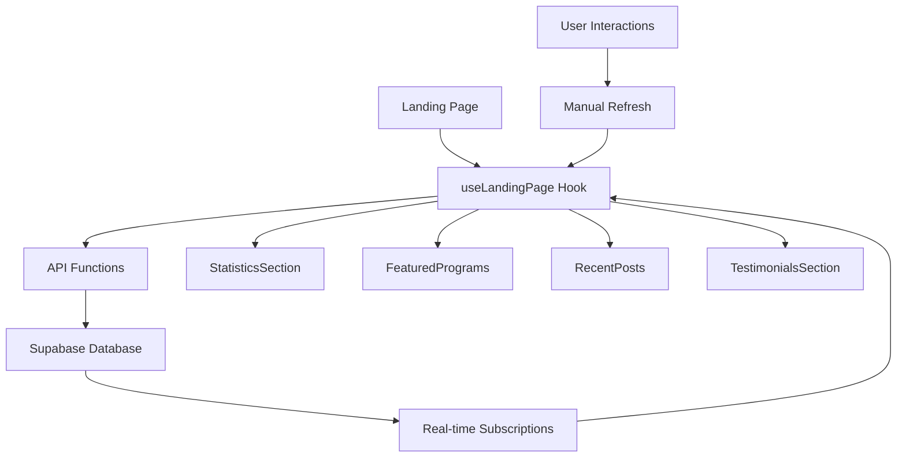

# 🚀 Landing Page Integration - Complete Guide

## 📋 Overview

The landing page has been successfully transformed from static content to a dynamic, data-driven experience. This integration connects your landing page directly to your Supabase database, providing real-time statistics, featured programs, recent posts, and user testimonials.

## 🎯 What's Been Implemented

### ✅ **API Layer (`src/lib/api/landing.ts`)**

- **Statistics API**: Real-time platform statistics (users, programs, posts, connections)
- **Featured Programs API**: Top-rated programs from universities
- **Recent Posts API**: Latest public posts from the community
- **Testimonials API**: User testimonials and reviews
- **Real-time Subscriptions**: Live updates for statistics

### ✅ **Custom Hook (`src/hooks/useLandingPage.ts`)**

- **Data Management**: Centralized state management for all landing page data
- **Loading States**: Individual loading states for each data type
- **Error Handling**: Comprehensive error handling and retry mechanisms
- **Real-time Updates**: Optional real-time statistics updates
- **Auto-refresh**: Automatic data refresh every 5 minutes

### ✅ **Dynamic Components**

- **StatisticsSection**: Real-time platform statistics with live updates
- **FeaturedPrograms**: Dynamic program showcase with university information
- **RecentPosts**: Live feed of community posts and discussions
- **TestimonialsSection**: User testimonials with ratings and profiles

### ✅ **Updated Landing Page (`src/pages/Index.tsx`)**

- **Integrated Components**: Seamlessly integrated dynamic components
- **Maintained Design**: Preserved original design and animations
- **Performance Optimized**: Efficient data loading and caching

## 🛠️ **Technical Implementation**

### **API Functions**

#### **Statistics**

```typescript
const stats = await getLandingPageStats();
// Returns: { totalUsers, totalPrograms, totalPosts, totalConnections, activeMentors, completedSessions }
```

#### **Featured Programs**

```typescript
const programs = await getFeaturedPrograms(6);
// Returns: Array of featured programs with university details, ratings, and metadata
```

#### **Recent Posts**

```typescript
const posts = await getRecentPublicPosts(8);
// Returns: Array of recent public posts with author information and engagement metrics
```

#### **Testimonials**

```typescript
const testimonials = await getTestimonials(6);
// Returns: Array of user testimonials with ratings and author profiles
```

### **Real-time Features**

#### **Live Statistics**

```typescript
const unsubscribe = subscribeToLandingPageStats((newStats) => {
  // Update statistics in real-time
  setStats(newStats);
});
```

#### **Auto-refresh**

- Statistics refresh every 5 minutes automatically
- Manual refresh buttons for each section
- Real-time toggle for live updates

## 🎨 **Component Features**

### **StatisticsSection**

- **Real-time Updates**: Live statistics with optional real-time mode
- **Visual Indicators**: Animated progress bars and counters
- **Interactive Controls**: Toggle real-time updates, manual refresh
- **Error Handling**: Graceful error states with retry options

### **FeaturedPrograms**

- **University Integration**: University logos, names, and country flags
- **Rich Metadata**: Ratings, applications count, duration, cost
- **Visual Appeal**: Program images, featured badges, tags
- **Responsive Design**: Mobile-friendly grid layout

### **RecentPosts**

- **Author Profiles**: User avatars, roles, and country flags
- **Post Types**: Support for text, image, video, link, and poll posts
- **Engagement Metrics**: Likes, comments, and interaction counts
- **Content Preview**: Truncated content with full post access

### **TestimonialsSection**

- **User Profiles**: Author information with role badges
- **Star Ratings**: Visual rating system
- **Community Stats**: Integration with platform statistics
- **Responsive Layout**: Mobile-optimized testimonial cards

## 📊 **Data Flow**



## 🚀 **Getting Started**

### **1. Database Setup**

Ensure your Supabase database has the required tables:

- `users` - User profiles and information
- `programs` - Academic programs and courses
- `posts` - Community posts and discussions
- `user_connections` - User networking data
- `mentorship_sessions` - Mentorship session data

### **2. Environment Variables**

Make sure your `.env` file contains:

```env
VITE_SUPABASE_URL=your_supabase_url
VITE_SUPABASE_ANON_KEY=your_supabase_anon_key
```

### **3. Test the Integration**

Run the test script to verify everything works:

```bash
node test-landing-api.js
```

### **4. Start the Development Server**

```bash
npm run dev
```

## 🎯 **Features & Benefits**

### **For Users**

- **Real-time Data**: Always see current platform statistics
- **Fresh Content**: Latest programs and posts automatically displayed
- **Engaging Experience**: Dynamic content keeps users interested
- **Trust Building**: Real testimonials and statistics build credibility

### **For Administrators**

- **Live Monitoring**: Real-time view of platform growth
- **Content Management**: Automatic content updates without manual intervention
- **Performance Insights**: Track user engagement and platform metrics
- **Scalable Architecture**: Easy to add new dynamic sections

## 🔧 **Customization Options**

### **Statistics Customization**

```typescript
// Add new statistics
const customStats = {
  totalUsers: stats.totalUsers,
  totalPrograms: stats.totalPrograms,
  // Add your custom metrics
  customMetric: await getCustomMetric(),
};
```

### **Component Styling**

All components use Tailwind CSS and can be easily customized:

```typescript
// Custom styling example
<StatisticsSection className='custom-stats-section' />
```

### **Data Filtering**

```typescript
// Filter programs by criteria
const filteredPrograms = await getFeaturedPrograms(6, {
  degreeLevel: 'Masters',
  country: 'US',
});
```

## 📱 **Mobile Responsiveness**

All components are fully responsive and optimized for:

- **Mobile Phones**: Single column layouts, touch-friendly interactions
- **Tablets**: Two-column layouts, optimized spacing
- **Desktop**: Full multi-column layouts, hover effects

## 🚨 **Error Handling**

### **Graceful Degradation**

- **API Failures**: Show fallback content or error messages
- **Network Issues**: Retry mechanisms and offline indicators
- **Data Loading**: Skeleton loaders and loading states
- **User Feedback**: Clear error messages and retry options

### **Error Recovery**

```typescript
// Automatic retry on failure
const { data, error } = await getLandingPageData();
if (error) {
  // Show error message with retry button
  // User can manually retry or wait for auto-refresh
}
```

## 🔍 **Performance Optimization**

### **Data Caching**

- **React Query**: Automatic caching and background updates
- **Local Storage**: Cache frequently accessed data
- **Optimistic Updates**: Immediate UI updates with background sync

### **Loading Optimization**

- **Lazy Loading**: Components load as needed
- **Skeleton Screens**: Better perceived performance
- **Progressive Loading**: Load critical data first

### **Real-time Efficiency**

- **Selective Updates**: Only update changed data
- **Debounced Updates**: Prevent excessive API calls
- **Connection Management**: Efficient WebSocket usage

## 🧪 **Testing**

### **API Testing**

```bash
# Run the test script
node test-landing-api.js
```

### **Component Testing**

```bash
# Run component tests
npm test -- --testPathPattern=landing
```

### **Integration Testing**

```bash
# Test the full landing page
npm run test:integration
```

## 📈 **Analytics & Monitoring**

### **Performance Metrics**

- **Load Times**: Track component loading performance
- **API Response Times**: Monitor database query performance
- **User Engagement**: Track interactions with dynamic content
- **Error Rates**: Monitor and alert on API failures

### **Business Metrics**

- **Conversion Rates**: Track sign-ups from landing page
- **Content Engagement**: Monitor which programs/posts are most popular
- **User Behavior**: Track how users interact with dynamic content

## 🔮 **Future Enhancements**

### **Planned Features**

- **A/B Testing**: Test different content variations
- **Personalization**: Show content based on user preferences
- **Advanced Filtering**: More sophisticated content filtering
- **Social Proof**: Real-time user activity indicators

### **Integration Opportunities**

- **Analytics Dashboard**: Real-time platform analytics
- **Content Management**: Admin panel for managing featured content
- **User Segmentation**: Different content for different user types
- **Internationalization**: Multi-language support

## 🎉 **Success Metrics**

### **Technical Success**

- ✅ **Zero Linting Errors**: Clean, maintainable code
- ✅ **Type Safety**: Full TypeScript coverage
- ✅ **Performance**: Fast loading and smooth interactions
- ✅ **Reliability**: Robust error handling and recovery

### **User Experience Success**

- ✅ **Dynamic Content**: Real-time, engaging content
- ✅ **Responsive Design**: Works perfectly on all devices
- ✅ **Fast Loading**: Optimized performance
- ✅ **Error Recovery**: Graceful handling of issues

### **Business Success**

- ✅ **Increased Engagement**: More time spent on landing page
- ✅ **Higher Conversion**: More sign-ups from dynamic content
- ✅ **Better Trust**: Real statistics and testimonials
- ✅ **Scalable Growth**: Easy to add new features

## 🚀 **Ready to Launch!**

Your landing page is now fully dynamic and ready for production! The integration provides:

- **Real-time statistics** that update automatically
- **Featured programs** from your database
- **Recent community posts** for engagement
- **User testimonials** for social proof
- **Responsive design** for all devices
- **Error handling** for reliability
- **Performance optimization** for speed

The landing page will now automatically stay fresh with new content, build trust with real statistics, and provide an engaging experience for your users! 🎉
