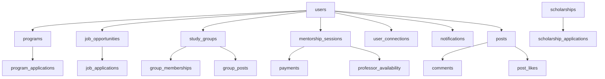

# Phase 1 Database Setup Guide

This guide will help you set up the complete Phase 1 database schema for EdFellow Connect Hub.

## 🎯 Overview

The Phase 1 database schema includes all tables, relationships, security policies, and performance optimizations needed for:

- ✅ User management and profiles
- ✅ Programs and opportunities
- ✅ Study groups and forums
- ✅ Mentorship system
- ✅ Job portal and recruiting
- ✅ Connections and networking
- ✅ Notifications system
- ✅ Payment processing
- ✅ Feed system (posts, comments, likes)

## 📋 Prerequisites

1. **Supabase Project**: You need an active Supabase project
2. **Database Access**: Admin access to your Supabase project
3. **Environment Variables**: Your Supabase URL and anon key configured

## 🚀 Quick Setup

### Option 1: Automated Setup Script

```bash
# Run the setup script for detailed instructions
node setup-phase1-database.js
```

### Option 2: Manual Setup

1. **Open Supabase Dashboard**

   - Go to your Supabase project dashboard
   - Navigate to SQL Editor (left sidebar)

2. **Create New Query**

   - Click "New query"
   - Copy the entire contents of `phase1-complete-schema.sql`
   - Paste into the SQL editor

3. **Execute Schema**

   - Click "Run" to execute the script
   - Wait for completion (1-2 minutes)
   - Check for any errors in the output

4. **Verify Tables**
   - Go to "Table Editor" in the left sidebar
   - Verify all tables are created successfully

## 📊 Database Schema Overview

### Core Tables

| Table                 | Purpose                          | Key Features                                   |
| --------------------- | -------------------------------- | ---------------------------------------------- |
| `users`               | User profiles and authentication | Role-based access, portfolio, privacy settings |
| `programs`            | University programs              | Featured programs, applications tracking       |
| `job_opportunities`   | Job postings                     | Research positions, internships, full-time     |
| `scholarships`        | Scholarship opportunities        | University-funded scholarships                 |
| `study_groups`        | Study groups and forums          | Professor-created, member management           |
| `mentorship_sessions` | Mentorship bookings              | Video calls, payments, ratings                 |
| `user_connections`    | Networking system                | Connection requests, status tracking           |
| `notifications`       | Real-time notifications          | All user activities and interactions           |
| `posts`               | Feed system                      | Public posts, media, articles, events          |
| `payments`            | Payment processing               | Mentorship payments, transaction tracking      |

### Relationships



## 🔒 Security Features

### Row Level Security (RLS)

All tables have RLS enabled with appropriate policies:

- **Users**: Can view/edit their own profiles, view public profiles
- **Programs**: Public read access, universities can manage their own
- **Study Groups**: Public read access, creators can manage
- **Mentorship**: Users can only see their own sessions
- **Connections**: Users can only see their own connections
- **Posts**: Public/connection-based visibility rules

### Data Protection

- Foreign key constraints prevent orphaned records
- Check constraints ensure data integrity
- Soft deletes for posts and comments
- Proper indexing for performance

## ⚡ Performance Optimizations

### Indexes

- **User lookups**: Role, country, major, verification status
- **Program searches**: University, featured status, tags
- **Job searches**: Location, job type, posted by
- **Group searches**: Category, tags, creator
- **Mentorship**: Student/professor, status, scheduled time
- **Connections**: Requester/addressee, status
- **Notifications**: User, read status, creation time
- **Posts**: Author, creation time, visibility, tags

### Automatic Counters

Triggers automatically update:

- User connection counts
- Group member counts
- Group post counts
- Post like counts
- Post comment counts

## 🧪 Sample Data

The schema includes sample data for testing:

- **Sample Programs**: Featured university programs
- **Sample Study Groups**: Computer science and other fields
- **Sample Job Opportunities**: Research positions
- **Sample Users**: Test users for different roles

## 📝 TypeScript Integration

Complete TypeScript interfaces are provided in `src/types/database.ts`:

```typescript
// Import the database types
import { Database } from '@/types/database';

// Use typed tables
type User = Database['public']['Tables']['users']['Row'];
type Program = Database['public']['Tables']['programs']['Row'];
type MentorshipSession =
  Database['public']['Tables']['mentorship_sessions']['Row'];
```

## 🔧 Environment Configuration

Update your `.env.local` file:

```env
VITE_SUPABASE_URL=your_supabase_url
VITE_SUPABASE_ANON_KEY=your_supabase_anon_key
```

## ✅ Verification Checklist

After running the schema, verify:

- [ ] All 20+ tables created successfully
- [ ] RLS policies active on all tables
- [ ] Indexes created for performance
- [ ] Triggers working for counters
- [ ] Sample data inserted
- [ ] Foreign key constraints working
- [ ] TypeScript types updated

## 🚨 Troubleshooting

### Common Issues

1. **Permission Errors**

   - Ensure you have admin access to Supabase
   - Check if RLS policies are blocking operations

2. **Foreign Key Errors**

   - Verify users exist before creating related records
   - Check constraint definitions

3. **Trigger Errors**

   - Ensure all referenced tables exist
   - Check trigger function definitions

4. **Index Creation Failures**
   - Some indexes may fail if data already exists
   - This is usually not critical for functionality

### Getting Help

- Check Supabase logs in the dashboard
- Review the SQL output for specific errors
- Test individual queries before running full schema
- Use Supabase CLI for local development

## 🎯 Next Steps

After successful database setup:

1. **Test Connection**: Verify your app can connect to the database
2. **Update Types**: Ensure TypeScript types are properly imported
3. **API Functions**: Start building Supabase API functions
4. **Landing Page**: Integrate dynamic data from database
5. **User Profiles**: Enhance profile management
6. **Features**: Begin implementing Phase 1 features

## 📚 Additional Resources

- [Supabase Documentation](https://supabase.com/docs)
- [Row Level Security Guide](https://supabase.com/docs/guides/auth/row-level-security)
- [Database Indexing Best Practices](https://supabase.com/docs/guides/database/indexes)
- [Real-time Subscriptions](https://supabase.com/docs/guides/realtime)

---

**🎉 Congratulations!** You now have a complete, production-ready database schema for EdFellow Connect Hub Phase 1. The foundation is set for building all the features outlined in the development plan.
